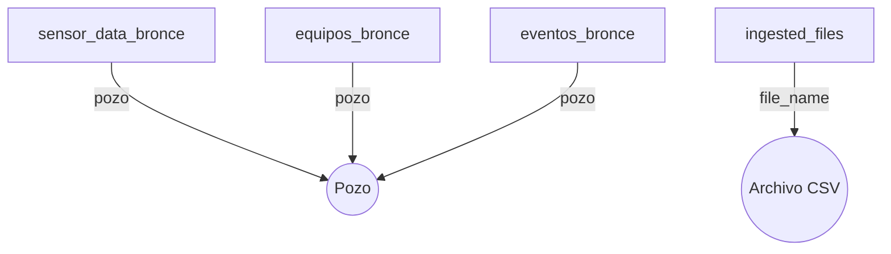

# 📋 Documentación de Tablas - Base de Datos Bronce

## 🔎 Propósito

La base de datos **Bronce** del proyecto `esp_project` almacena los datos crudos tal como fueron extraídos desde archivos `.csv`, con el objetivo de:

- Conservar la estructura original de los datos.
- Asegurar trazabilidad y auditoría.
- Servir como base para futuras transformaciones (nivel Plata y Oro).

---

## 📃 Tablas disponibles

### 1. `sensor_data_bronce`

Contiene registros crudos de sensores de equipos ESP.

| Columna               | Tipo      | Descripción                                    |
| --------------------- | --------- | ---------------------------------------------- |
| `id_ingestion`        | TEXT      | UUID único generado por fila.                  |
| `pozo`                | TEXT      | Identificador del pozo (ej. "457").            |
| `ingestion_timestamp` | TIMESTAMP | Fecha y hora exacta de ingestón.               |
| `source_file`         | TEXT      | Nombre del archivo fuente.                     |
| `raw_data`            | JSON      | Registro original serializado en formato JSON. |

---

### 2. `equipos_bronce`

Contiene información técnica de equipos ESP instalados en cada pozo.

| Columna                   | Tipo      | Descripción                           |
| ------------------------- | --------- | ------------------------------------- |
| `id_ingestion`            | TEXT      | UUID por fila.                        |
| `pozo`                    | TEXT      | Pozo al que pertenece el equipo.      |
| `modelo_bomba`            | TEXT      | Modelo del sistema de bombeo.         |
| `marca_bomba`             | TEXT      | Marca del sistema de bombeo.          |
| `modelo_motor`            | TEXT      | Modelo del motor asociado.            |
| `numero_equipo`           | TEXT      | Identificador del equipo.             |
| `fecha_entrada_operacion` | TIMESTAMP | Fecha y hora de entrada en operación. |
| `fecha_salida_operacion`  | TIMESTAMP | Fecha y hora de salida de operación.  |
| `ingestion_timestamp`     | TIMESTAMP | Fecha de carga a la base de datos.    |
| `source_file`             | TEXT      | Archivo fuente original.              |

---

### 3. `eventos_bronce`

Contiene eventos de operación ocurridos en cada pozo (paros, reinicios, etc.).

| Columna                | Tipo      | Descripción                                   |
| ---------------------- | --------- | --------------------------------------------- |
| `id_ingestion`         | TEXT      | UUID por fila.                                |
| `pozo`                 | TEXT      | Pozo afectado.                                |
| `categoria_principal`  | TEXT      | Tipo principal de evento (ej. Mantenimiento). |
| `categoria_secundaria` | TEXT      | Clasificación específica del evento.          |
| `fecha_paro`           | TIMESTAMP | Inicio del evento.                            |
| `fecha_reinicio`       | TIMESTAMP | Fin del evento.                               |
| `comentario`           | TEXT      | Observaciones adicionales.                    |
| `ingestion_timestamp`  | TIMESTAMP | Fecha de carga al sistema.                    |
| `source_file`          | TEXT      | Archivo fuente.                               |

---

### 4. `ingested_files`

Tabla auxiliar para evitar duplicados de ingestón.

| Columna               | Tipo      | Descripción                          |
| --------------------- | --------- | ------------------------------------ |
| `file_name`           | TEXT      | Nombre del archivo CSV ya procesado. |
| `ingestion_timestamp` | TIMESTAMP | Fecha/hora de ingestón del archivo.  |

---

## 📊 Diagrama Entidad-Relación (ER)



> **Nota:** el nodo "Pozo" es implícito en el campo `pozo` de cada tabla. El nodo "Archivo CSV" representa el origen documental trazable por `source_file` o `file_name`.

---

## 📦 Ubicación del esquema

El esquema SQL está disponible en:

```
esp_project/database/schema_bronze.sql
```

Se ejecuta automáticamente mediante:

```bash
python run_pipeline.py
```

Esto garantiza que las tablas estén listas antes de la carga de datos.