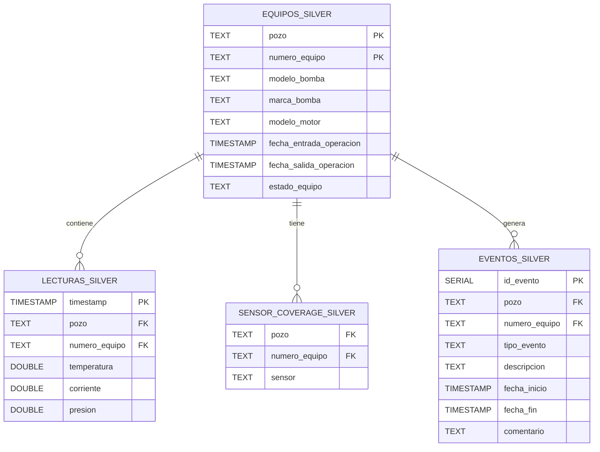

# 📋 Documentación de Tablas - Base de Datos Silver

## 🔎 Propósito

La base de datos **Silver** del proyecto `esp_project` almacena los datos procesados provenientes de la base de datos **Bronce**, con el objetivo de:

- Tener los datos limpios procendetes de las lecturas de los sensores.
- Funcionar como base para generar modelos de ML y LLM.
- Funcionar como fuente de la verdad para analisis posteriores.

---

## 📃 Tablas disponibles

# 📃 Tablas disponibles en la Base de Datos Silver

---

### 1. `lecturas_silver`
Contiene los datos de sensores interpolados, organizados por pozo y número de equipo.

| Columna              | Tipo                     | Descripción                                           |
| -------------------- | ------------------------ | ----------------------------------------------------- |
| `timestamp`          | TIMESTAMP WITH TIME ZONE | Fecha y hora real de la medición del sensor (UTC).    |
| `pozo`               | TEXT                     | Identificador del pozo.                              |
| `numero_equipo`      | TEXT                     | Identificador del equipo.                            |
| `temperatura`        | DOUBLE PRECISION         | Valor interpolado de temperatura (si existe).        |
| `corriente`          | DOUBLE PRECISION         | Valor interpolado de corriente (si existe).          |
| `presion`            | DOUBLE PRECISION         | Valor interpolado de presión (si existe).            |

---

### 2. `sensor_coverage_silver`
Contiene el catálogo de sensores disponibles por cada equipo.

| Columna              | Tipo     | Descripción                           |
| -------------------- | -------- | ------------------------------------- |
| `pozo`               | TEXT     | Identificador del pozo.              |
| `numero_equipo`      | TEXT     | Identificador del equipo.            |
| `sensor`             | TEXT     | Nombre del sensor disponible.        |

---

### 3. `equipos_silver`
Contiene información técnica de los equipos, incluyendo su estado actual (activo/inactivo).

| Columna                   | Tipo                     | Descripción                                       |
| ------------------------- | ------------------------ | ------------------------------------------------- |
| `pozo`                    | TEXT                     | Identificador del pozo.                          |
| `numero_equipo`           | TEXT                     | Identificador del equipo.                        |
| `modelo_bomba`            | TEXT                     | Modelo del sistema de bombeo.                    |
| `marca_bomba`             | TEXT                     | Marca del sistema de bombeo.                     |
| `modelo_motor`            | TEXT                     | Modelo del motor asociado.                       |
| `fecha_entrada_operacion` | TIMESTAMP WITH TIME ZONE | Fecha y hora de inicio de operación del equipo.  |
| `fecha_salida_operacion`  | TIMESTAMP WITH TIME ZONE | Fecha y hora de fin de operación del equipo.     |
| `estado_equipo`           | TEXT                     | Estado calculado del equipo ('activo' o 'inactivo'). |

---

### 4. `eventos_silver`
Contiene los eventos operativos registrados en los pozos, con asignación al equipo correspondiente si aplica.

| Columna              | Tipo                     | Descripción                                      |
| -------------------- | ------------------------ | ------------------------------------------------ |
| `id_evento`          | SERIAL PRIMARY KEY       | Identificador único del evento.                   |
| `pozo`               | TEXT                     | Identificador del pozo donde ocurrió el evento.   |
| `numero_equipo`      | TEXT                     | Número de equipo asociado al evento (puede ser NULL). |
| `tipo_evento`        | TEXT                     | Categoría principal del evento.                  |
| `descripcion`        | TEXT                     | Descripción más específica del evento.            |
| `fecha_inicio`       | TIMESTAMP WITH TIME ZONE | Inicio del evento.                               |
| `fecha_fin`          | TIMESTAMP WITH TIME ZONE | Fin del evento.                                  |
| `comentario`         | TEXT                     | Observaciones adicionales.                       |

---

## 📊 Diagrama Entidad-Relación (ER)



---

## 📦 Ubicación del esquema

El esquema SQL está disponible en:

```
esp_project/database/schema_silver.sql
```

Se ejecuta automáticamente mediante:

```bash
python run_pipeline.py
```

Esto garantiza que las tablas estén listas antes de la carga de datos.

## ℹ️ Notas importantes

- Todas las fechas (```timestamp```, ```fecha_inicio```, ```fecha_fin```, etc.) están en **UTC**.

- El identificador de los registros de sensores y eventos es la combinación de ```timestamp```, ```pozo```, y ```numero_equipo```.

- Los sensores disponibles pueden variar por equipo; el catálogo ```sensor_coverage_silver``` ayuda a determinar cobertura real.

- La columna ```estado_equipo``` en ```equipos_silver``` es calculada automáticamente con base en la fecha de salida de operación.

- Es posible que existan eventos que no puedan asignarse a un ```numero_equipo``` si no coincide su fecha con ninguna ventana de operación de los equipos (en cuyo caso, ```numero_equipo``` es NULL).